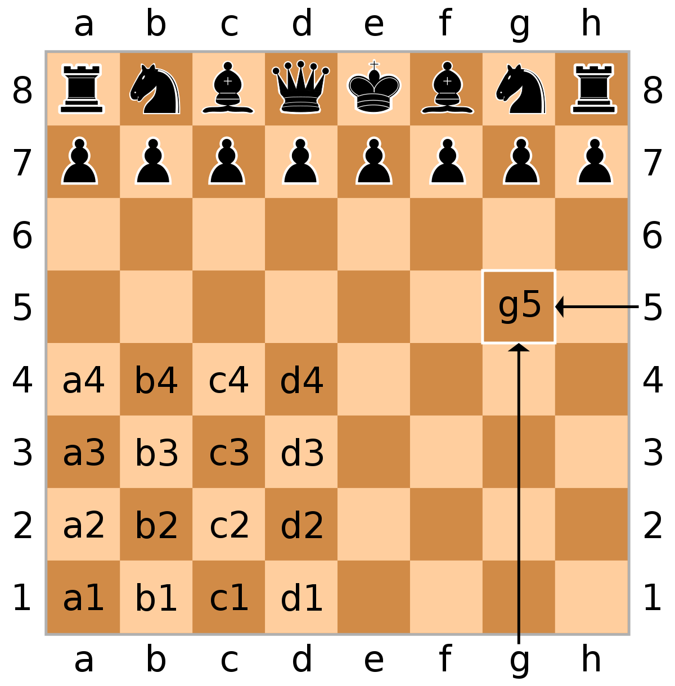
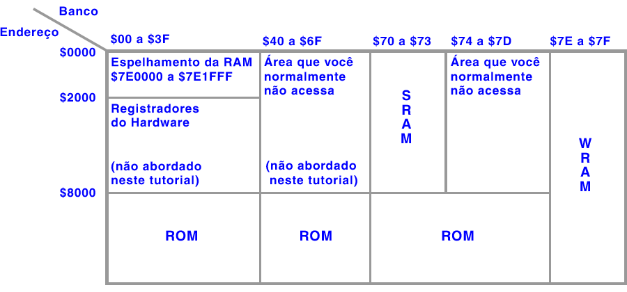

# O Livro de Assembly para SNES

# Sobre a Tradução

A tradução e revisão deste documento é um esforço coletivo de membros da cena de ROM hacking brasileira, são eles: Gambas, Israel, Joapeer e Ondinha, com o único intuito de prover documentação de qualidade e em português a todos que tenham interesse no SNES/65c816 no Brasil. Esperamos que seja útil em seu aprendizado!

# Sumário

* [Introdução](#Introdução)
* [Iniciando](#Iniciando)
* [Contribuindo](#Contribuindo)

## O Básico

* [Hexadecimal](#Hexadecimal)
* [Binário](#Binário)
* [Memória](#A-Memória-do-SNES)
* [Registradores](#Os-Registradores-do-SNES)
* [Modos de Endereçamento](#Modos-de-Endereçamento)
* [Little-endian](#Little-endian)
* [Glossário](#Glossário)

## O Básico(novamente)

* [Carregando e Armazenando](#Carregando-e-Armazenando)
* [Encurtando Endereços](#Encurtando-Endereços)
* [Modo 8 e 16 *bits*](#Modo-8-e-16-bits)
* [Comparações, Desvios e Rótulos](programming/branches.md)
* [Salto para sub-rotinas](programming/subroutine.md)

## Coleção de Valores

* [Tabelas e indexação](coleções/indexação.md)
* [A pilha](coleções/pilha.md)
* [Copiando dados](coleções/movimentos.md)

## Flags e Registradores do Processador

* [Flags do processador](processor/flags.md)
* [Alterando as Flags do processador](processor/repsep.md)
* [Transferências](processor/transfer.md)
* [Registrador Stack pointer](processor/stackpointer.md)

## Matemática e Lógica

* [Operações aritméticas](math/arithmetic.md)
* [Operações de deslocamento de bits](math/shift.md)
* [Operações bit a bit](math/logic.md)
* [Hardware math](math/math.md)

## Aprofundando-se

* [Modos de endereçamento revistados](indepth/addressing.md)
* [Opcodes diversos](indepth/misc.md)
* [Ciclos da máquina](indepth/cycles.md)
* [Vetores de hardware](indepth/vector.md)
* [Técnicas](indepth/techniques.md)
* [Sintaxe do assembler comum](indepth/syntax.md)
* [Precauções de programação](indepth/cautions.md)

# Introdução

Este tutorial é uma versão online do meu tutorial de assembly 65c816 que está hospedado em [SMW Central](https://www.smwcentral.net/). Originalmente, eu escrevi este tutorial para ensinar à comunidade SMW Central a linguagem assembly 65c816 em inglês simples. Hoje em dia, ele é lido por várias pessoas na cena de ROM hacking em geral. Portanto, decidi abrir o código deste tutorial no GitHub, para que as pessoas possam fazer melhorias ou traduções.

Embora eu seja um membro do SMW Central, este tutorial não está associado ao Super Mario World, portanto, este tutorial não foi feito para esse jogo. Em vez disso, este tutorial pode ser aplicado em todo o contexto SNES.

## A Linguagem

O assembly 65c816 é a linguagem usada pelo chip \(SNES\) Ricoh 5A22 do Super Nintendo Entertainment System. Dividindo as diferentes partes do acrônimo 65c816: 816 significa que o processador pode assumir o modo de 8-bits ou no modo de 16-bits. O c significa CMOS, 65 significa que este processador pertence à família de CPU's 65xx. O processador devia ser bastante revolucionário para a época. Este tutorial explica mnemônicos/instruções \(opcodes\) e como usá-los corretamente. Este tutorial não se concentra em tópicos específicos do SNES, como registradores do hardware.

Com ASM 65c816 você pode codificar coisas para os jogos de SNES \(como recursos personalizados para Super Mario World\). ASM é uma linguagem de programação de 2ª geração, de baixo nível em comparação com C\#, por exemplo. É um código de máquina legível, que eventualmente é traduzido em código de máquina hexadecimal. Todos os opcodes consistem em 3 letras, acompanhado de vários parâmetros.

## Agradecimentos Especiais

Meus agradecimentos especiais a essas pessoas que revisaram o tutorial original no SMW Central: **[spigmike](https://www.smwcentral.net/?p=profile&id=132), [Roy](https://www.smwcentral.net/?p=profile&id=845), [smkdan](https://www.smwcentral.net/?p=profile&id=411), [S.N.N](https://www.smwcentral.net/?p=profile&id=23), [andy\_k\_250](https://www.smwcentral.net/?p=profile&id=67), [Domiok](https://www.smwcentral.net/?p=profile&id=7211), [reghrhre](https://www.smwcentral.net/?p=profile&id=4176), [ChaoticFox](https://www.smwcentral.net/?p=profile&id=3462), [Tails\_155](https://www.smwcentral.net/?p=profile&id=6151), [GreenHammerBro](https://www.smwcentral.net/?p=profile&id=18802), [Vitor Vilela](https://www.smwcentral.net/?p=profile&id=8251)**

E também agradeço muito aos [contribuintes](https://github.com/Ersanio/snes-assembly-book/graphs/contributors) deste repositório!

# Iniciando

## IDE

Não há IDEs dedicados para assembly 65c816. Você pode usar qualquer editor de texto ASCII, como o Notepad ou VS Code. No entanto, algumas pessoas criaram vários plugins para editores de código existentes para adicionar recursos extras, como destaque de sintaxe:

* Plugin "[65816 Assembly](https://marketplace.visualstudio.com/items?itemName=joshneta.65816-assembly)" de Josh Neta para o VS Code;
* Plugin "[65816 SNES Assembly Language Server](https://marketplace.visualstudio.com/items?itemName=vicerust.snes-asm)" de Vice para para o VS Code;
* Plugin '"[65xx Assembly Language Support](https://atom.io/packages/language-65asm)" de MatthewCallis para o Atom.

Os arquivos escritos em código assembly geralmente são salvos com a extensão ".asm".

## Assemblers

Este tutorial usa a sintaxe que é usada por um assembler chamado "Asar", originalmente escrito por Alcaro, agora mantido por vários membros da comunidade SMW Central. Este assembler está hospedado no SMW Central e pode ser baixado [aqui](https://www.smwcentral.net/?p=section&a=details&id=19043). O repositório GitHub do Asar pode ser encontrado [aqui](https://github.com/RPGHacker/asar).

# Contribuindo
Este capítulo é destinado aos que contribuem com este tutorial. Ao escrever,  há alguns padrões que devem ser seguidos para maximizar a sua consistência ao longo do tutorial.

## Estilo
Essas diretrizes se referem ao estilo do documento.

### Tabelas
- Sentenças e frases dentro das células da tabela geralmente não devem terminar com um ponto final;
- As tabelas que apresentam os opcodes devem ter os opcodes em **negrito** e ter pelo menos as três colunas, conforme mostrado no exemplo a seguir:

| Opcode  | Nome completo         | Explicação            |
| ------- | --------------------- | --------------------- |
| **LDA** | Carrega no acumulador | Carrega um valor em A |

## Terminologia
| Regra                                                        | Exemplo                                                      |
| ------------------------------------------------------------ | ------------------------------------------------------------ |
| Ao referir-se ao processador `Ricoh 5A22`, use` o SNES` em vez disso | `O SNES` é capaz de entrar no modo de 8 ou 16 bits           |
| Ao referir-se a uma área específica na memória SNES, sempre prefixe `endereço` a ela, de preferência com a área de memória (ou seja,`RAM`) | \(O\) `endereço da RAM` $7E0000 contém [...]                 |
| Ao referir-se aos registradores A, X e Y, basta usar `A`,`X` ou `Y` | Agora `A` está no modo de 8 bits. `X` é usado para indexar endereços |
| Ao referir-se a valores, sempre acrescente um `valor` antes  | A contém o `valor` $00                                       |

## Códigos de exemplo
- O código deve ser indentado quando houver rótulos, sub-rótulos ou rótulos mais ou menos na mesma linha que uma instrução. O recuo do texto indentado deve ser igual ao comprimento do rótulo mais longo mencionado anteriormente no bloco de código, incluindo os dois pontos ("`:`"), mais dois espaços adicionais;
- O código deve usar espaços em branco para indentação, sem tabulação;
- Os opcodes são escritos inteiramente em maiúsculas (ex: `LDA`);
- Os rótulos são escritas em PascalCase (ex: `Label1:`);
- As sub-rótulos são escritos em minúsculas, sublinhados e o nome deve se adequar semanticamente ao rótulo pai, sem redundância (ex: `.return`).
- As definições são escritas em PascalCase (ex: `!SomeDefine`);
- Dados diretos (`db`, `dw`, `dl`, `dd`) e especificadores de comprimento de opcode (`.b`,`.w`, `.l`) são escritos inteiramente em minúsculas;
- Os indicadores de comentários (`;`) devem começar na coluna 20 e preenchidos à esquerda por espaços em branco, não por tabulações;
    - Se não houver espaço para um comentário na coluna 20, ele começará na mesma linha;
- Os indicadores de comentários devem ser seguidos por um espaço em branco, antes do próprio comentário;
- Haverá uma nova linha extra após os opcodes `RTS`, `RTL`, `RTI`, `JMP`,  `JML`, `BRA`, `BRL`;
- Estas são orientações que devem ser seguidas o mais estritamente possível, mas pode haver casos excepcionais.

Exemplo:
```
SomeLabel:         ; Este label está em sua própria linha
LDA.b #$42
STA $00            ; Isto é um comentário
RTS

.table:
db $01,$02,$03,$04 ; Outro comentário

.second_table:
db $01,$02,$03,$04,$01,$02,$03,$04 ; Um comentário excepcional

TestLabel: LDA #$02 ; Este rótulo está na mesma linha que uma instrução
           STA $01
           BNE +
           NOP
+          RTS      ; O código está indentado de acordo com "TestLabel"
```

# O Básico

# Hexadecimal

Para programar em ASM 65c816 , você precisará entender o básico de hexadecimal. Hexadecimal, também conhecido como "hex", é um sistema numérico muito parecido com o decimal, que é o sistema de contagem que as pessoas usam diariamente. No hexadecimal, existem 6 dígitos adicionais para cada casa numérica, que são representados pelas letras A, B, C, D, E e F, conforme a tabela abaixo.

| Decimal | Hexadecimal |
| :------ | :---------- |
| 0       | 0           |
| 1       | 1           |
| 2       | 2           |
| 3       | 3           |
| 4       | 4           |
| 5       | 5           |
| 6       | 6           |
| 7       | 7           |
| 8       | 8           |
| 9       | 9           |
| 10      | A           |
| 11      | B           |
| 12      | C           |
| 13      | D           |
| 14      | E           |
| 15      | F           |
| 16      | 10          |
| 17      | 11          |
| ...     | ...         |
| 255     | FF          |

Há várias maneiras de escrever números hexadecimais para que os leitores não possam confundi-los com números decimais. São os seguintes:

* Prefixo "0x" \(0x42\)
* Prefixo "$"  \($42\)
* Sufixo  "H"  \(42H\)

Por convenção, neste tutorial usaremos o "$" para prefixar os números hexadecimais.

Em assembly, um número hexadecimal com dois dígitos é chamado de “byte”. Isso significa que os valores entre $00 a $FF são considerados como um byte.

## Valores com e sem sinal

No mundo real, os números podem ser positivos ou negativos. Em assembly, dependendo do código, os valores podem ser tratados como "com sinal" ou "sem sinal". Isso significa que os valores com sinal também podem ser negativos: Os valores de $80 para cima são considerados números negativos em decimal, começando em -128 e diminuindo conforme o número hexadecimal vai aumentando, como você pode ver na tabela abaixo.

| Decimal | Hexadecimal |
| :------ | :---------- |
| 126     | $7E         |
| 127     | $7F         |
| -128    | $80         |
| -127    | $81         |
| ...     | ...         |
| -1      | $FF         |

A presença de números negativos depende da programação do jogo. Por exemplo, um jogador pode ter velocidade positiva e negativa \(resultando em ir para frente ou para trás\), mas um jogador não pode ter vidas ou pontos extras negativos \(até porque isso não faz sentido\). Não há necessidade em dizer que o valor -0 não existe.

## Valores hexadecimais de quatro dígitos

Os números hexadecimais podem passar além dos dois dígitos, como pode ser visto abaixo.

| Decimal | Hexadecimal |
| :------ | :---------- |
| 254     | $FE         |
| 255     | $FF         |
| 256     | $0100       |
| 257     | $0101       |
| ...     | ...         |
| 65535   | $FFFF       |

O formato deste número hexadecimal é: $HHLL.

* HH é o "high byte" ou byte mais significativo;
* LL é o "low byte"  ou byte menos significativo.

# Binário

Outro sistema numérico importante é o “binário”. O binário tem apenas valores de dois dígitos para cada casa numérica: 0 e 1. Um dígito binário também é chamado de "bit". Na sintaxe do assembly, os bits são prefixados por "%".

Um *byte* é composto por oito “bits”. Como um dígito binário tem dois valores possíveis e um *byte* tem 8 *bits*, isso significa que há 2⁸(256) possibilidades em apenas um *byte*.

Por exemplo, um *byte* pode conter os seguintes *bits*: `1001 0110` ou `1001 0101`. O primeiro *bit* da esquerda é chamado de “bit 7” e o *bit* final é chamado de “bit 0”. Eles **não** são chamados de *bits* 0-7, nem *bits* 8-1. A seguir temos uma visão geral dos *bits*:

```
Bit 7654 3210

    1001 0110
    1001 0101
    .... ....
```

A tabela abaixo mostra um modo relativamente fácil de memorizar binários.

| Binário      | Hexadecimal |
| ------------ | ----------- |
| `%0000 0001` | `$01`       |
| `%0000 0010` | `$02`       |
| `%0000 0100` | `$04`       |
| `%0000 1000` | `$08`       |
| `%0001 0000` | `$10`       |
| `%0010 0000` | `$20`       |
| `%0100 0000` | `$40`       |
| `%1000 0000` | `$80`       |

Observe que há um espaço entre 4 *bits* para facilitar a leitura, embora os assemblers geralmente não aceitem esse formato. Os grupos de 4 *bits* são chamados de "nibbles" e, para os propósitos deste capítulo, eles existem para tornar o binário mais fáceis de serem lidos. Um *nibble* corresponde a um dígito em hexadecimal.

O SNES é capaz de trabalhar com números de 8 *bits* e 16 *bits*. Enquanto os números de 8 *bits* são chamados de *byte*, os números de 16 *bits* são chamados de "word". Eles tem a seguinte aparência quando convertidos para binários de 16 *bits*: `10000101 11010101` (que é iqual a `$85D5` em hexadecimal\). No caso de números de 16 *bits*, o *bit* mais à esquerda é chamado de "bit 15", enquanto o bit mais à direita é chamado de "bit 0":

```text
    1111 11             (leia de cima para baixo)
Bit 5432 1098 7654 3210
    1000 0101 1101 0101
    0000 0000 1001 0110
    .... .... .... ....
```

## Sinalizadores

O binário é imensamente útil quando você está atribuindo a um valor hexadecimal várias finalidades, como uma chave que liga e desliga determinados recursos. Esses *bits* são chamados de "Sinalizadores" e geralmente são usados para economizar espaço na memória dos jogos.

Por exemplo, você pode dividir um *byte* em 8 *bits*, com cada *bit possuir um significado diferente. O *bit* 7 pode indicar que um nível tem chuva ou não. O *bit* 6 pode indicar que um layout de nível é horizontal ou vertical. O *bit* 5 pode indicar que a configuração do nível é durante o dia ou noite, etc. Dessa forma, você pode compactar as informações em um único *byte*. Ficaria assim em binário:

```text
10100000
││└───── Indica que "Está de dia"
│└────── Indica que "Está no nível horizontal"
└─────── Indica que "Está chovendo"
```

Finalmente, aqui está uma visão geral de como contar em decimal, hexadecimal e binário:

| Decimal | Hexadecimal | Binário      |
| ------- | ----------- | ------------ |
| `00`    | `$00`       | `%0000 0000` |
| `01`    | `$01`       | `%0000 0001` |
| `02`    | `$02`       | `%0000 0010` |
| `03`    | `$03`       | `%0000 0011` |
| `04`    | `$04`       | `%0000 0100` |
| `05`    | `$05`       | `%0000 0101` |
| `06`    | `$06`       | `%0000 0110` |
| `07`    | `$07`       | `%0000 0111` |
| `08`    | `$08`       | `%0000 1000` |
| `09`    | `$09`       | `%0000 1001` |
| `10`    | `$0A`       | `%0000 1010` |
| `11`    | `$0B`       | `%0000 1011` |
| `12`    | `$0C`       | `%0000 1100` |
| `13`    | `$0D`       | `%0000 1101` |
| `14`    | `$0E`       | `%0000 1110` |
| `15`    | `$0F`       | `%0000 1111` |
| `16`    | `$10`       | `%0001 0000` |
| `17`    | `$11`       | `%0001 0001` |
| ...     | ...         | ...          |
| `254`   | `$FE`       | `%1111 1110` |
| `255`   | `$FF`       | `%1111 1111` |

## Notação

Às vezes, os *bits* podem ser escritos de forma inconsistente, como `11` ou` 110 0000`. Isso torna o número binário mais difícil de ler, porque a convenção geral é escrever *bits* em grupos de oito. Para lê-los, você precisará adicionar zeros antes dos dígitos até que haja 8 *bits* ou 16 *bits* no total.

Em 8 *bits*:

* `11` torna-se `00000011`
* `1100000` torna-se `01100000`

Em 16 *bits*:

* `11` torna-se `00000000 00000011`
* `1100000` torna-se `00000000 01100000`

Você pode converter entre decimal, hexadecimal e binário, usando o modo de "programação" da calculadora do seu sistema operacional. Existem também muitas calculadoras online que podem fazer isso. A sintaxe do assembly também aceita números decimais, portanto, geralmente não é necessário converter entre decimal e hexadecimal.

# A Memória do SNES

Trabalhar assembly envolve escrever um monte de instruções em que você carrega um "valor" e o armazena em um "endereço" para obter o efeito desejado, como alterar o *powerup* do jogador, por exemplo. Ao gravar dados em assembly, você trabalhará com a memória do SNES na maior parte do tempo.

A memória do SNES é basicamente uma região de *bytes*, e cada *byte* está localizado em um "endereço". Pense nisso como um tabuleiro de xadrez:



Você pode ver que para se referir a uma determinada casa, a imagem faz uso de nomes de colunas e casas. Na imagem acima o "endereço" da rainha \(o "valor" \) seria o endereço D8, por exemplo. Além disso, uma única casa não pode conter duas unidades. Este mesmo conceito se aplica à memória do SNES.

A memória do SNES é mapeada do endereço $000000 a $FFFFFF, embora apenas os endereços de $00000 a $7FFFFF sejam usados na maioria dos casos. O formato de um endereço é o seguinte: $BBHHDD.

* BB é o "byte do banco";
* HH é o "High byte" ou *Byte* mais significativo;
* DD é o "Low byte" ou *Byte* menos significativo.

Os endereços podem ser escritos de 3 maneiras: $BBHHDD, $HHDD e $DD, como $7E0003, $0003 e $03.

* $DD são os “endereços de página direta”
* $HHDD são os “endereços absolutos”
* $BBHHDD são os “endereços longos”

Conforme estabelecido anteriormente, um endereço pode conter apenas um *byte*. Se você acessar um determinado endereço no modo 16 *bits*, significa que você realmente está acessando o "endereço" e "endereço + 1", porque um número de 16 *bits* consiste em dois *bytes*.

A figura a seguir temos uma visão geral da memória básica do SNES \(também conhecido como mapa de memória\):



Este mapa de memória está no formato "LoROM". Se você é um hacker de SMW, não precisa se preocupar com o que isso significa; apenas considere este mapa de memória por garantia.

## ROM

*ROM* significa "Read-Only Memory" e é exatamente isso: uma memória que só pode ser lida. Isso significa que você não pode alterar a *ROM* armazenando valores nela com o *ASM*. Você pode dizer que é o próprio jogo ou programa, que contém todo o código *ASM* e tabelas de dados, bem como recursos como gráficos, música e assim por diante. Alternativamente: é o arquivo .smc/.sfc/.fig/etc. que você carrega em emuladores.

## RAM

*RAM* significa "Random-Access Memory". Esta é a memória dinâmica que permite que qualquer coisa seja escrita nela a qualquer momento. Você poderia dizer que este é o lugar onde você tem as variáveis que são importantes e têm significado. A *RAM* pode ser gravada para obter um certo efeito. Por exemplo, se você escrever $04 nas vidas extras do jogador, e ele terá exatamente 4 vidas extras.

A *RAM* do SNES tem o tamanho 128kB e está localizado nos endereços de $7E0000 a $7FFFFF. A *RAM* é totalmente genérica. Não existe uma regra como “o endereço $7E0120 é usado para as vidas do jogador em todos os jogos SNES.” Você mesmo define a finalidade da *RAM*, escrevendo seu próprio código *ASM*.

O mapa de memória mostra que os bancos $00-3F contêm um "espelho" da *RAM*. Os endereços de *RAM* espelhados são endereços que contêm o mesmo valor em todos os bancos. Isso significa que o endereço de *RAM* $001234 contém exatamente o mesmo valor de $0F1234 em todos os momentos. Ter a *RAM* espelhada significa que o código em execução na *ROM* nesses bancos pode acessar a *RAM* de $7E0000 a $7E1FFF com mais "facilidade". Por outro lado, o código executado nos bancos $40-6F tem mais problemas para acessar a *RAM* porque a *RAM* não é espelhada nesse local.

Por razões de simplicidade, você **sempre** pode assumir que o banco $00 é igual ao banco $7E.

## SRAM

*SRAM* significa "Static Random-Access Memory". Também tem o tamanho de 128kB e está localizado em blocos de 32kB entre $700000 a $707FFF, $710000 a $717FFF, $720000 a $727FFF e $730000 a $737FFF, embora o tamanho final da *SRAM* dependa das próprias especificações de *ROM*, graças a algo chamado "cabeçalho interno da ROM". a *SRAM* não é espelhada em outros bancos.

*SRAM* se comporta exatamente como *RAM*; você pode armazenar e carregar qualquer coisa nela, mas os valores não são apagados quando o SNES é reiniciado. A memória *SRAM* é mantida viva por uma bateria que está presente em um cartucho de SNES. Quando a bateria se esgota ou é removida, a *SRAM* não funcionará corretamente e possivelmente perderá os dados após cada reinicialização. Nos emuladores, a *SRAM* é armazenada nos arquivos ".srm".

*SRAM* é geralmente usada para salvar arquivos, embora também possa ser usada como uma memória *RAM* extra.

# Os Registradores do SNES

O SNES possui vários “registradores” que são usados para diferentes finalidades. Não podemos nos esquecer deles; são uma das razões pelas quais possibilitam o SNES funcionar corretamente.. Basicamente, registradores são “variáveis globais” que podem ser usados para armazenar valores, ou podem ser usados em operações matemáticas, lógica e todas aquelas coisas sofisticadas! Esses registradores podem ser acessados a qualquer momento.

## Acumulador (A)

O acumulador, também conhecido como **A**, é usado para operações matemáticas em geral, deslocamento de *bits*, operações *bit* a *bit* e carregamento de valores indiretos. `A` também pode conter variáveis ​​de uso geral para armazenar valores na memória e em outros registradores. Este registrador pode conter um valor de 8 ou 16 *bits*.

O acumulador às vezes é referido como `B` ou `C` em alguns opcodes. `B` significa o *byte* mais significativo do acumulador, enquanto `C` significa o acumulador completo de 16 *bits*.

> Na verdade, esse registrador pode ser sempre considerado como de 16 *bits*. Quando `A` está no modo de 8 *bits*, você acessa o *byte* menos significativo desse registrador. Quando `A` está no modo de 16 *bits* você acessa ambos, o *byte* mais significativo e o menos significativo desse registrador ao mesmo tempo. O *byte* mais significativo não é apagado quando `A` entra no modo de 8 *bits*, mesmo quando novos valores são gravados em `A`, razão pela qual o *byte* mais significativo pode ser considerado "oculto". Além disso, certas instruções usam ambos os *bytes* do registrador `A`, independentemente de `A` estar no modo de 8 ou 16 *bits*.

## Indexadores (X,Y)

Os indexadores são dois registradores, conhecidos como **X** e **Y**. Embora sejam registradores separados, eles têm exatamente as mesmas finalidades e se comportam exatamente da mesma forma. Esses registradores são feitos para indexação, explicada posteriormente neste tutorial. Esses registradores também podem ser de 8 ou 16 *bits*. `X` e `Y` também podem conter variáveis ​​de uso geral para armazenar valores na memória e em outros registradores.

`X` e `Y` são “interligados” - e só podem estar no modo de 8 ou 16 *bits* ao mesmo tempo. Um deles não pode ser de 8 *bits* e o outro de 16 *bits*.

Quando `X` e `Y` saem do modo de 16 *bits*, seus *bytes* mais significativos tornam-se o valor $00, ao contrário do registrador `A`, onde o *byte* mais significativo permanece intacto.

## Página Direta (D)

O registrador página direta é um registrador de 16 *bits*, usado no modo de endereçamento de página direta (explicado posteriormente neste tutorial). Quando você acessa um endereço da memória pela notação de página direta, o valor da página direta atual é adicionado nesse endereço. Geralmente, você pode ignorar esse registrador se estiver apenas iniciando em assembly.

## Ponteiro da Pilha (SP)

O ponteiro da pilha é um registrador de 16 *bits* que mantém o ponteiro do pilha na *RAM* (explicado mais tarde neste tutorial), relativo ao endereço de memória $000000. O registrador muda dinamicamente, conforme você adiciona e requisita valores na pilha (explicado posteriormente no tutorial).

## Estado do Processador (P)

O registrador de estado do processador contém os sinalizadores do processador no formato de 8 *bita*. Existem 8 sinalizadores de processador e todos ocupam um *bit*. Alterar esse registrador também modifica o comportamento do SNES. Os sinalizadores do processador são explicados posteriormente neste tutorial.

## Banco dos Dados (DB)

O registrador de banco dos dados contém um único *byte* que é o endereço do banco dos dados atual. Quando você acessa um endereço usando a notação de "endereço absoluto", o SNES usará esse registrador para determinar o banco do endereço.

## Banco do Programa (PB)

O registrador do banco do programa mantém registro do banco atual da instrução executada. Assim, se houver um código executado no endereço $018009, este registrador terá valor $01.

## Contador do Programa (PC)

Este registrador contém os *bytes* mais significativo e menos significativo do endereço da instrução que será executada no momento. Portanto, se houver uma instrução executada em $018009, este registrador terá o valor $8009.

# Modos de Endereçamento

Existem diferentes modos de endereçamento no 65c816. Os modos de endereçamento são usados para fazer com que os opcodes acessem endereços e valores de maneira diferente, como "indexado" ou "direto indiretot" (explicado posteriormente neste tutorial). Usando-os com sabedoria, você pode acessar valores e endereços de memória de várias maneiras. Por exemplo, você pode carregar imediatamente um valor em um registrador, como `A`, ou carregar um byte da ROM em `A`. Lembre-se de que nem todos os opcodes suportam todos os modos de endereçamento. Aqui estão alguns dos modos de endereçamento importantes que você usará com frequência.

## Imediato 8 ou 16 *bits*

Este modo de endereçamento define um valor absoluto, que é escrito como #$XX no modo 8 *bits* ou #$XXXX no modo 16 *bits*. O # significa "valor imediato", enquanto o $ significa hexadecimal. Usar # sozinho torna a entrada decimal. Por exemplo, #10 é igual a #$0A. Pense em um valor imediato como um número que você está definindo diretamente.

## Página Direta

Este modo de endereçamento define um endereço página direta, que é escrito como $XX.

A página direta são os últimos 2 dígitos hexadecimais de um endereço longo. Por exemplo, endereçar $7E0011 como página direta seria $11. Ao carregar de um endereço página direta, o byte do banco é SEMPRE tratado como $00, sem exceções. Se você escrever “LDA $11” por exemplo, você carregaria o conteúdo de $000011 no acumulador, que também é espelhado em $7E0011 (lembre-se da ilustração da memória SNES). Portanto, você carrega o conteúdo de $7E0011 em `A`.

## Absoluto

Este modo de endereçamento define um endereço absoluto, que é escrito como $XXXX.

Um endereço absoluto são os últimos 4 dígitos hexadecimais de um endereço longo. Usando o exemplo anterior, o endereço $7E0011 como um endereço absoluto seria $0011. O byte do banco do endereço absoluto é determinado pelo registrador de banco dos dados.

## Longo

Este modo de endereçamento define um endereço longo, que é escrito como $XXXXXX.

Endereços longos oferecem menos complicações ao lidar com bancos e espelhamento. Você também não precisa se preocupar com o que o registrador de banco dos dados contém atualmente. Com endereços longos, você pode acessar qualquer endereço na memória SNES.

## Outros modos de endereçamento

O SNES oferece suporte a mais modos de endereçamento. Os descritos acima são os básicos. Existem outros, tais como: versões indexadas de página direta, endereçamentos absolutos e longos e muito mais. Eles serão explicados no final deste tutorial porque você não precisa deles neste momento. Isso tornaria as coisas ainda mais confusas.

# Little-endian

Dentro da memória do SNES, os valores de 16 *bits* e 24 *bits* são sempre armazenados em "*little-endian*". Tome por exemplo o valor $1234 que armazenamos na RAM; $1234 não aparece como $12 $34. Ao invés disso, aparece como $34 $12. É assim que funciona o SNES. Quando esse número é lido no modo de 16 *bits*, ele mostra $1234, NÃO $3412. O SNES reverte isso automaticamente.

Os valores de 24 *bits* não são exceção. Valores, como $123456, são armazenados na memória como $56 $34 $12.

Você pode escrever tudo em *ASM* normal sem se preocupar com o *endianness*, pois tudo é tratado automaticamente pelo SNES e pelo assembler! Você deve se preocupar com *endianness* ao lidar com valores de 16 *bits* no modo de 8 *bits*.

Por exemplo: se você armazenar o valor $1234 no endereço $7E0000, ele será armazenado como $34 $12. Então, se quiser acessar o *byte* inferior de $1234 (que é $34), você precisará ler $7E0000, NÃO $7E0001.

O conceito de *little-endian* é especialmente importante ao lidar com "ponteiros", que é explicado mais tarde neste tutorial.

# Glossário

Aqui estão algumas definições dos termos mais comuns usados neste tutorial. Por uma questão de contexto e continuidade, é melhor ler de cima para baixo.

| Terminologia             | Definição                                                    |
| ------------------------ | ------------------------------------------------------------ |
| SNES                     | Super Nintendo Entertainment System                          |
| Memória                  | O espaço de trabalho no SNES em que a ROM, RAM e SRAM estão presentes |
| ROM                      | Read-only memory; Os arquivos .smc/.sfc/.fig/*.etc           |
| (W)RAM                   | (Work) Random-access memory                                  |
| SRAM                     | Static random-access memory; O arquivo .srm                  |
| Registrador              | Uma variável no SNES que não faz parte da memória padrão do SNES |
| Opcode                   | Uma instrução de três letras; Um comando                     |
| Modo de Endereçamento    | Um parâmetro opcional para um opcode denotando um valor ou endereço |
| Instrução/Operação       | A combinação de um opcode e opcionalmente um modo de endereçamento |
| Bytecode                 | Uma instrução montada em bytes e inteligível para o processador; Código de máquina |
| Valor                    | Uma magnitude, quantidade ou número; Um número representando informação |
| Com sinal                | Um valor que semânticamente se permite ser negativo          |
| Sem sinal                | Um valor que semânticamente se permite ser apenas positivo, possibilitando acesso a números positivos maiores. |
| Endereço                 | Um local na memória do SNES. Vai de $000000 a $FFFFFF        |
| Endereço longo           | Um endereço representado, em notação hexadecimal, por 6 dígitos, por exemplo: $001200 |
| Endereço absoluto        | Um endereço representado, em notação hexadecimal, por 4 dígitos, por exemplo: $1200 |
| Página direta            | Um endereço representado, em notação hexadecimal, por 2 dígitos, por exemplo: $00. |
| Byte                     | Um valor com 8 *bits*                                        |
| Word                     | Um valor com 16 *bits*                                       |
| Long                     | Um valor com 24 *bits*                                       |
| Double                   | Um valor com 32 *bits*                                       |
| Byte do Banco            | Os primeiros dois dígitos em um endereço longo ou valor longo, por exemplo: '$12' em $123456) |
| Byte mais significativo  | Os dígitos do meio em um endereço longo ou valor longo, por exemplo: '$34' em $123456) |
| Byte menos significativo | Os últimos dois dígitos de um endereço longo ou valor longo, por exemplo: '$56' em $123456) |

# O Básico(novamente)

# Carregando e Armazenando

A primeira coisa que você precisa saber ao iniciar em assembly é como carregar e armazenar os dados usando os registradores do SNES. Os opcodes básicos para carregar e armazenar dados são `LDA` e `STA`.

Como mencionado anteriormente, há 3 registradores principais:

* O acumulador **A**;
* Os indexadores **X** e **Y**.

Embora esses registradores possam estar no modo de 8 *bits* ou 16 *bits*, neste tutorial os consideraremos 8 *bits* por padrão.

## LDA e STA

| Opcode  | Nome completo          | Explicação                           |
| ------- | ---------------------- | ------------------------------------ |
| **LDA** | Load into accumulator  | Carrega um valor em A                |
| **STA** | Store from accumulator | Armazena o valor de A em um endereço |

Usaremos endereços da RAM para simplificar. Abaixo, temos um exemplo de como carregar e armazenar valores.

```
LDA #$03           ; A = $03
STA $7E0001
```

Agora, veremos o que  esse código está fazendo linha por linha.

```
LDA #$03
`````

Essa instrução carrega o valor $03 em `A`. O `#` significa que estamos carregando um valor de fato e não um endereço. Após a execução da instrução, o conteúdo do registrador `A` torna-se $03. `LDA` pode carregar valores em `A`, no intervalo entre $00 a $FF no modo 8 *bits* entre $0000 a $FFFF no modo 16 *bits*.

```
STA $7E0001
```

A instrução acima armazena o valor de `A` no endereço $7E0001 da RAM. Como o valor de `A` é $03, o valor armazenado no endereço $7E0001 passa a ser $03 também. O conteúdo do registrador `A` **não** é apagado. Isso significa que você pode armazená-lo em vários endereços diferentes, dessa forma:

```
LDA #$03
STA $7E0001
STA $7E0053
```

Um erro comum de iniciante é escrever `STA #$7E0001` ou outra forma qualquer de "`STA #$`". Esta instrução não existe. Também não faz sentido; não há lógica em armazenar o valor de `A` em outro valor.

> Lembre-se de que usar `$` em vez de `#$` após o opcode, significa que o parâmetro é um endereço e não um valor imediato.

Colocar um ponto-e-vírgula (;) faz com que tudo após este sinal seja ignorado pelo *assembler*, durante a estapa de montagem do código. Em outras palavras: ` ;` é usado para comentários, por exemplo:

```
LDA #$03         ; Isto aqui é um comentário!
```

### Carregando e armazenando endereços

Qual seria a utilidade de armazenar valores em um endereço da RAM se você não pudesse acessá-lo novamente? Você pode carregar o conteúdo de um endereço da RAM no registrador `A` usando `LDA` com um modo de endereçamento diferente. vejamos o exemplo a seguir:

```
LDA $7E0013
STA $7E0042
```

E mais uma vez, linha por linha.

```
LDA $7E0013
```

Esta linha carregará o conteúdo do endereço $7E0013 da RAM em `A`. Suponhamos que o conteúdo seja $33. Então, `A` possuirá o valor $33. O conteúdo de $7E0013 permanecerá o mesmo, pois `LDA` copia o número ao invés de extraí-lo do endereço. Observe que desta vez usamos `$` em vez de `#$`, pois queríamos acessar um endereço da RAM. E por fim, tanto `A` quanto  $7E0013 possuem o valor $33.

```
STA $7E0042
```

Esta instrução armazenará o conteúdo do registrador `A` no endereço $7E0042 da RAM. A permanecerá inalterado. O endereço $7E0042 agora é $33. Em síntese: Este código está copiando o conteúdo de $7E0013 para $7E0042.

## LDY, STY, LDX e STX

Agora que aprendemos o básico sobre como carregar e armazenar valores em endereços, vamos introduzir os mesmos opcodes de carregamento, mas para os registradores de indexação:

| Opcode  | Nome completo | Explicação                           |
| ------- | ------------- | ------------------------------------ |
| **LDY** | Load into Y   | Carrega um valor em Y                |
| **STY** | Store from Y  | Armazena o valor de Y em um endereço |
| **LDX** | Load into X   | Carrega um valor em X                |
| **STX** | Store from X  | Armazena o valor de X em um endereço |

Os opcodes acima se comportam da mesma forma que `LDA` e `STA`. A diferença é que eles usam os registradores `X` e `Y` em vez do acumulador. Por exemplo:

```
LDY #$03
STY $0001
```

Este código irá armazenar o número $03 no endereço $7E0001 da RAM, utilizando o registrador `Y`. Para o registrador `X`, use `LDX` e `STX`. Quanto ao motivo pelo qual o endereço é $0001 em vez de $7E0001, consulte o capítulo:  [Encurtando Endereços](#Encurtando-Endereços)

## STZ

Existe um opcode que armazena o número $00 nos endereços.

| Opcode  | Nome completo        | Explicação                           |
| ------- | -------------------- | ------------------------------------ |
| **STZ** | Store zero to memory | Define o valor de um endereço como 0 |

Este opcode armazena o número $00 em um endereço. Ele nem precisa que os registradores `A`, `X` ou `Y` sejam previamente carregados com $00.

Se você precisar de um código que armazene diretamente $00 em um endereço da RAM, você pode fazê-lo com apenas uma linha de código:

```
STZ $01          ; $7E0001 = $00. Nenhum registrador é afetado.
```

`STZ` armazenará zero em um endereço da RAM. Após esta instrução, o endereço $7E0001 conterá o número $00. Usar o `STZ` quando no modo de 16 *bits* armazenará $0000 em ambos os endereços $7E0001 e $7E0002 da RAM.

# Encurtando Endereços

É possível encurtar endereços, mas há pré-requisitos.

Para encurtar um endereço longo da RAM em um endereço absoluto (4 dígitos), o endereço deve estar entre $7E0000 - $7E1FFF. $7E1234 pode ser reduzido para $1234, por exemplo. Se você encurtar o endereço $7E2000 ou superior em um endereço de 4 dígitos, você escreverá em outras áreas além da RAM. Isso tem a ver com o registrador data bank e com o mapa de memória do SNES.

Se você quiser encurtar os endereços longos da RAM para um endereço página direta (2 dígitos), o *byte* mais significativo do endereço longo nunca devem exceder o valor $ 00FF. O endereço que você deseja armazenar deve ser no banco $00 ou $7E. Portanto, você pode encurtar `LDA $7E0001` para` LDA $01` e `STA $000001` para` STA $01`.

Freqüentemente, é necessário escrever endereços mais curtos como parâmetros, pois certos opcodes não suportam certos modos de endereçamento. Por exemplo, o opcode `STZ` não suporta endereços longos, então você não pode escrever `STZ $7E1234`. Você terá que escrever `STZ $1234` em vez disso.

Lembre-se de que quando você usa 2 dígitos para carregar e armazenar, o banco é sempre $00 por padrão, independentemente do registrador do banco dos dados! Você pode usar endereços de 2 dígitos para endereços de RAM $7E0000 - $7E00FF, porque a RAM $7E0000 - $7E1FFF é espelhado nos bancos $00 - $3F.

# Modo 8 e 16 *bits*

O SNES pode entrar nos modos de 8 *bits* ou 16 *bits*. Isso significa que os registradores `A`, `X` e `Y` podem carregar tanto valores de 16 *bits* quanto valores de 8 *bits*.

Existem algumas maneiras de alternar entre os modos de 8 e 16 *bits*. A tabela a seguir demonstra todas as maneiras possíveis:

| Código   | Explicação                                     |
| -------- | ---------------------------------------------- |
| REP #$10 | Define o modo de 16 *bits* para `X` e `Y`      |
| REP #$20 | Define o modo de 16 *bits* para `A`            |
| REP #$30 | Define o modo de 16 *bits* para `A`, `X` e `Y` |
| SEP #$10 | Define o modo de 8 *bits* para `X` e `Y`       |
| SEP #$20 | Define o modo de 8 *bits* para `A`             |
| SEP #$30 | Define o modo de 8 *bits* para `A`, `X` e `Y`  |


Os opcodes `REP` e `SEP` serão abordados posteriormente neste tutorial. Por enquanto, isso é tudo que você precisa saber.

No modo 16 *bits* do acumulador, os seguintes recursos entram em vigor:

* O acesso a memória, envolverá 2 endereços de RAM em vez de 1;
* Esses dois endereços de RAM serão sempre adjacentes;
* Os valores imediatos (#$) serão de 16 *bits*;
* Os valores serão carregados e armazenados como *little-endian* na memória, mas você não precisa se preocupar com isso.

Vamos começar com um exemplo imediatamente:

```
REP #$20
LDA #$0001
STA $7E0000
SEP #$20
```

sendo que:

```
REP #$20
```

Aqui definimos o registrador `A` para o modo de 16 *bits*.

```
LDA #$0001
```

E aqui carregamos o valor de 16 *bits* $0001 em `A`, então `A` passa a possuir o valor $0001.

> Se você escrever $01 em vez de $0001, o código provavelmente travará! Isso ocorre porque a CPU do SNES espera um parâmetro de 16 *bits*, e você está fornecendo um parâmetro de apenas 8 *bits*.  Portanto, parte do próximo opcode será lido como parte do parâmetro de 16 *bits* lido anteriormente, fazendo com que os opcodes seguintes se tornem inválidos.

> Cada opcode (desconsiderando os parâmetros) torna-se um valor de 8 *bits* quando convertido em binário. É por isso que você só pode ver valores hexadecimais quando abre uma ROM em um editor hexadecimal. Para desmontar esses valores em código ASM, você precisará usar um “desmontador”.
> 

```
STA $7E0000
```

Aqui armazenamos um valor 16 *bits* de `A` de no endereço $7E0000 e $7E0001 na RAM. Mas por que dois endereços? Porque um valor 16 *bits* não cabe em apenas um endereço. Lembre-se de que um endereço representa um valor de 8 *bits*, portanto, dois endereços representam um valor de 16 *bits*. $7E0000 e $7E0001 combinados agora terão o valor $0001.

```
SEP #$20
```

Aqui definimos o modo de 8 *bits* para `A`.

Depois de executar as 4 instruções anteriores, ao darmos uma olhada na RAM, veremos algo assim:

```
$7E0000 | [01] [00] [XX] [XX] [XX] […]
```

O primeiro valor, $01, é o valor do endereço $7E0000. O segundo valor pertence a $7E0001. O terceiro valor a $7E0002, e assim por diante.

Como você pode ver, o valor armazenado tornou-se *little-endian*, mas normalmente não precisamos nos preocupar com isso. Se tentarmos carregá-lo de volta em `A`, teremos que usar `LDA $7E0000`. Isso carregaria o valor $0001 em `A` novamente se `A` estiver no modo de 16 *bits*, é claro. Se você tentasse carregá-lo de volta quando `A` estiver no modo 8 *bits*, ele carregaria apenas o valor $01 em `A`.

Também há o modo 16 *bits* para `X` e `Y`. E não está relacionado ao modo 16 *bits* de `A`. Se `A` estiver o modo 8 *bits* e `X`, `Y` no modo 16 *bits*, a seguinte situação é perfeitamente possível:

```
LDA #$13
LDX #$4242
```

# Comparações, desvios e labels

Você pode executar determinadas partes do código dependendo de certas condições. Para isso, você terá que fazer uso de instruções de comparação e desvio. As instruções de comparação, equiparam o conteúdo de A, X ou Y com um valor qualquer. Um opcode de desvio controla o fluxo do programa, dependendo (ou não) do resultado de uma comparação.

## Branches

Branches são instruções que controlam o fluxo do código que, dependendo do resultado das comparações, os Branches "desviam" para outros partes do código que são predeterminados por **labels**.

As instruções de desvio são limitadas a um intervalo de -128 a 127 bytes. Isso significa que elas só podem saltar 128 bytes para trás ou 127 bytes para frente, em relação ao program counter. Uma exceção é o `BRL` (Branch Long). `BRL` possui um intervalo de 32768 bytes (8000 em hexadecimal), que é igual ao tamanho de  um banco inteiro. Se o branch sair do intervalo, o assembler acusará um erro. Você terá que encontrar uma maneira de colocar o label de destino ao alcance do branch. O capítulo "dicas e truques" explicará mais sobre isso.

## Labels

Os labels são rótulos de textos colocados no código para demarcar um ponto de entrada de um salto ou uma “tabela”. Os labels não são instruções nem nada parecido. É basicamente uma maneira mais fácil de especificar um endereço, pois labels são transformados em números pelo assembler. É uma boa prática dar nomes significativos aos labels, para seu próprio bem. Os códigos de exemplo neste capítulo farão uso de labels.

## CMP

Para fazer comparações, você geralmente usa o conteúdo de `A` e um outro valor qualquer. A principal forma de fazer isso é com o instrução `CMP`.

| Opcode  | Nome completo | Explicação                 |
| ------- | ------------- | -------------------------- |
| **CMP** | Compare A     | Compara A com outro valor. |

`CMP` pega o valor que está carregado em A e compara com um parâmetro especifico. Depois de usar uma instrução `CMP`, você precisará usar uma instrução que realizará o “tipo de desvio” que você deseja que ocorra.

Também é possível comparar valores de 16-bit. Basta alterar `CMP #$xx` para `CMP #$xxxx`.

## BEQ e BNE

Existem instruções de desvio que saltam dependendo se a comparação dos valores forem iguais ou diferentes.

| Opcode  | Nome completo        | Explicação                                      |
| ------- | -------------------- | ----------------------------------------------- |
| **BEQ** | Branch if equals     | Salta se o valores comparados forem iguais.     |
| **BNE** | Branch if not equals | Salta se o valores comparados forem diferentes. |

`BEQ` salta se os valores forem iguais. Veja o exemplo abaixo:

```
LDA $00            ; Carrega o valor atual do endereço da RAM $7E0000 em A
CMP #$02           ; Compara A com o valor imediato $02
BEQ Label1         ; Se A = $02, vá para Label1. NOTA: Diferencia maiúsculas e minúsculas
LDA #$01           ; \ Senão
STA $1245          ; / Armazena o valor $01 no endereço $7E1245.
RTS                ; Esta instrução é usada para encerrar uma rotina.

Label1:
STZ $19            ; Armazene zero em $7E0019
RTS                ; Fim.
```

Este código armazenará zero ($00) em $7E0019 quando $7E0000 possuir  o valor $02, caso contrário o código armazenará o valor $01 em $7E1245. Como você pode ver, `BEQ` irá "saltar" para uma parte do código quando os valores comparados forem iguais, pulando um determinado código. Neste caso, o código salta para o código localizado na label “Label1”

`BNE` salta se os valores forem diferentes. Segue mais um exemplo:

```
LDA $00           ; Carrega o valor atual do endereço da RAM $7E0000 em A
CMP #$02          ; Compara A com $02
BNE Label1        ; A NÃO = $02, não faça nada e finalize o código.
LDA #$01          ; \ Senão
STA $1245         ; / Armazene algo no endereço da RAM $7E1245
Label1:           ;
RTS               ; Fim.
```

O código acima armazenará $01 em $7E1245, se $7E0000 possuir o valor $02. Senão, o código não fará nada e simplesmente finalizará.

## Comparando endereços

Você também pode comparar a partir de endereços da RAM. Por exemplo:

```
LDA $00           ; Carregue o valor de $7E0000 em A
CMP $02           ; Compare A com $7E0002
BEQ Equal         ; Vá para "Equal" se igual
```

Quando os endereços $7E0000 e $7E0002 tiverem os mesmos valores, o salto ocorrerá.

## CPX e CPY

Você também pode comparar usando os registradores `X` e `Y`.

| Opcode  | Nome completo | Explicação                 |
| ------- | ------------- | -------------------------- |
| **CPX** | Compare X     | Compara X com outro valor. |
| **CPY** | Compare Y     | Compara Y com outro valor. |

Não é somente `A` que pode ser comparado. Por exemplo, você pode carregar um valor em `X` ou `Y` e compará-lo com outro valor. Aqui temos um exemplo de uso do `X`:

```
LDX $00           ; Carregue o valor de $7E0000 em X
CPX $02           ; Compare X com $7E0002
BEQ Equal         ; Vá para "Equal" se igual
```

Teremos o mesmo resultado do exemplo com a comparação de endereços. Você também pode comparar `Y` usando `CPY`. No entanto, você não pode misturar registradores. O código a seguir está errado:

```
LDX $00
CMP $02
BEQ Equal
```

`CMP $02` tentaria comparar o endereço $7E0002 com o registrador `A` em vez de `X`, causando resultados inesperados.

## BMI e BPL

Estas são instruções de desvio que saltam dependendo se um valor é com sinal  ou sem sinal.

| Opcode  | Nome completo   | Explicação                                                |
| ------- | --------------- | --------------------------------------------------------- |
| **BMI** | Branch if minus | Salta se a última operação resultou em um valor negativo. |
| **BPL** | Branch if plus  | Salta se a última operação resultou em um valor positivo. |

`BMI` salta se a última operação resultar em um valor negativo. Os valores negativos são os valores de $80 a $FF. `BPL` salta se a última operação resultar em um valor positivo, ou seja, de $00 a $7F.

## BCS e BCC

Estes são instruções de desvio, dependendo se um valor é maior ou menor que.

| Opcode  | Nome completo         | Explicação                                                   |
| ------- | --------------------- | ------------------------------------------------------------ |
| **BCS** | Branch if carry set   | Salta se o valor carregado for maior ou igual ao valor comparado. |
| **BCC** | Branch if carry clear | Salta se o valor carregado for menor que o valor comparado.  |

`BCS` salta se o valor carregado for igual ou maior que o valor comparado. Como alternativa, também salta quando a flag de carry estiver ativada.

`BCC` salta se o valor carregado for menor que o valor comparado. Como alternativa, também salta quando o a flag de carry não estiver ativada. Observe que ao contrário do `BCS`, `BCC` não salta se os valores comparados forem iguais.

## BVS e BVC

Esses são instruções de desvio, dependendo se um valor resulta em um overflow matemático ou não.

| Opcode  | Nome completo            | Explicação                                               |
| ------- | ------------------------ | -------------------------------------------------------- |
| **BVS** | Branch if overflow set   | Salta se a comparação causar um overflow matemático.     |
| **BVC** | Branch if overflow clear | Salta se a comparação não causar um overflow matemático. |

As flags de  “overflow” e "carry" são flags do processador, serão abordadas posteriormente no tutorial.

## BRA e BRL

Estas são instruções de desvios incondicionais que sempre serão executados.

| Opcode  | Nome completo      | Explicação                                     |
| ------- | ------------------ | ---------------------------------------------- |
| **BRA** | Branch always      | Sempre efetua um desvio                        |
| **BRL** | Branch always long | Sempre efetua um desvio, mas com maior alcance |

`BRA` **sempre** saltará; ele nem mesmo valida as comparações.
O `BRL` faz o mesmo, mas com um maior alcance, o suficiente para cobrir metade de um banco para cada direção.